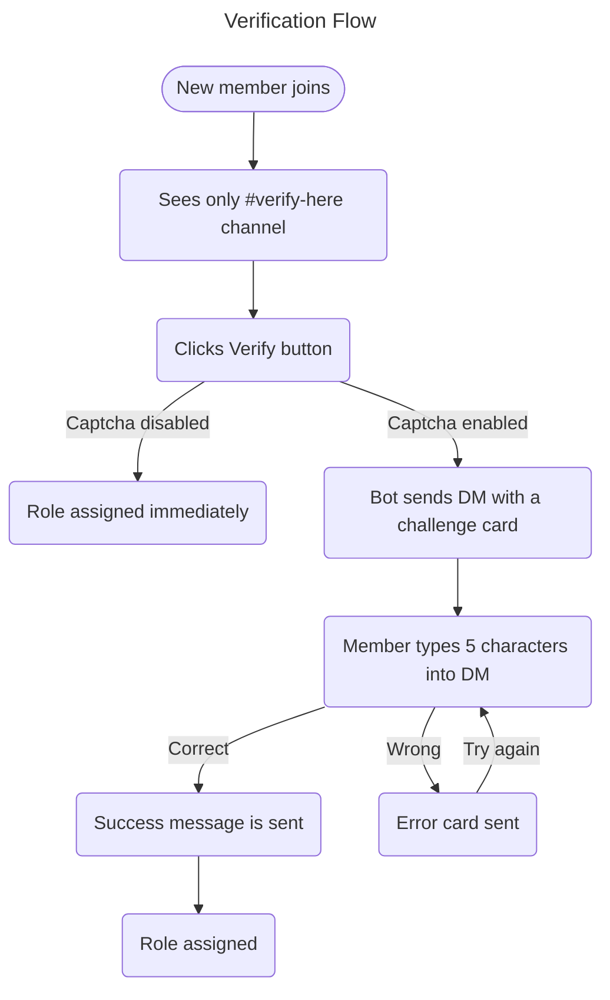

Das Verifizierungssystem von Nightfall fügt Ihrem Server ein **kontrolliertes Zugangstor** hinzu. Neue Mitglieder müssen einen Verifizierungsschritt abschließen, bevor sie Zugriff auf Kanäle erhalten, was Bot-Raids, Alt-Konto-Missbrauch und beiläufiges Trollen erheblich reduziert.

---

## So funktioniert es



---

## Bildcaptcha

Wenn Captcha aktiviert ist, ist jede Verifizierungs-Herausforderung ein **einzigartig gerendertes Bild**:

| Eigenschaft | Wert |
|----------|-------|
| Größe | 340 × 110 px |
| Antwortlänge | 5 Zeichen |
| Zeichensatz | `A–Z`, `2–9` — keine mehrdeutigen Zeichen (`O`, `0`, `I`, `1`, `l`) |
| Groß-/Kleinschreibung | Keine — `a7k2m` und `A7K2M` werden beide akzeptiert |
| Ablauf | 10 Minuten |

### Anti-Bypass-Eigenschaften

| Bypass-Versuch | Nightfalls Reaktion |
|---------------|---------------------|
| Wiederbeitritt nach der Verifizierung | Die Rolle wird beim Wiederbeitritt nicht automatisch neu zugewiesen; erneute Verifizierung erforderlich |
| Versuch, den Button zu skripten | DM-Antworten können von Standard-Bot-Bibliotheken nicht gescriptet werden |
| OCR-Angriffe auf das Captcha | Rauschen, Farbvariationen pro Zeichen, Jitter und Weichzeichnung behindern automatisiertes OCR |
| Bot-Neustart während der Verifizierung | Datenbank-gestützte Sitzungen stellen sicher, dass die Herausforderung nach dem Neustart weiterhin gültig ist |

---

## Einrichtung

### Anforderungen

1. Eine **Verifizierungsrolle**, die Zugriff auf den Rest des Servers gewährt
2. Ein **`#verify-here`-Kanal**, konfiguriert so:
   - `@everyone` — kann den Kanal sehen, kann keine Nachrichten senden, kann andere Kanäle nicht sehen
   - `@Verified` — vollständiger Serverzugriff
3. Ein Verifizierungspanel, das über `/verification post` veröffentlicht wird

### Empfohlene Einrichtungsschritte

1. Erstellen Sie einen `#verify-here`-Kanal
2. Legen Sie Kanalberechtigungen fest:
   - `@everyone` → View Channel ✅ · Send Messages ❌ · alle anderen Kanäle ❌
   - `@Verified` → alle Kanäle ✅
3. Erstellen Sie eine `@Verified`-Rolle
4. Führen Sie `/verification panel` aus → wählen Sie die Rolle → aktivieren → schalten Sie Image Captcha ein
5. Führen Sie `/verification post channel:#verify-here` aus
6. Verschieben Sie die Bot-Rolle von Nightfall **über** die `@Verified`-Rolle in **Servereinstellungen → Rollen**

---

## DM-Karte

**Herausforderungskarte (gesendet, wenn Verify geklickt wird):**

```
🔍  Verification Challenge
──────────────────────────────────
To access ServerName you must complete this captcha.

ℹ  Instructions:
› Look at the image below — it contains 5 characters
› Type only those characters in your reply to this DM
› Case‑insensitive — A7K2M and a7k2m both work

⏱️  You have 10 minutes to reply.
──────────────────────────────────
[ captcha image — 340 × 110 px ]
─ Nightfall Security  •  ServerName
```

**Abschlusskarte (DM bearbeitet nach korrekter Antwort):**

```
✅  Captcha Complete!
──────────────────────────────────
You've been successfully verified in ServerName.
✨  Welcome — you now have full server access.
──────────────────────────────────
[ greyed captcha + large green ✓ overlay ]
─ Nightfall Security  •  ServerName
```

---

## Integration mit Anti‑Raid

Die Verifizierung fungiert als **erste Verteidigungslinie** gegen Raids:

1. Beitretende Mitglieder landen im gesperrten Verifizierungskanal
2. Bot-Konten, die keine DMs empfangen oder verarbeiten können, werden hier gestoppt
3. Wenn Angreifer die Verifizierung umgehen und dennoch eine Beitrittsspitze erkannt wird, wird der **Anti‑Raid**-Ratenzähler als sekundäre Ebene ausgelöst

---

## Fehlerbehebung

| Problem | Wahrscheinliche Ursache | Lösung |
|---------|-------------|-----|
| Mitglied erhält keine DM | DMs deaktiviert | Bitten Sie es, **Direktnachrichten von Servermitgliedern erlauben** in den Datenschutzeinstellungen zu aktivieren |
| Verify-Button tut nichts | Fehlende Berechtigung | Stellen Sie sicher, dass der Bot `Manage Roles` hat |
| Andere Kanäle nach der Verifizierung nicht sichtbar | Falsche Kanalberechtigungen | Überprüfen Sie die `@everyone`-Kanalberechtigungs-Überschreibungen |
| Fehler „Role no longer exists" | Verifizierungsrolle gelöscht | Legen Sie eine neue über `/verification panel` fest |

---

*Verwandt: [Verifizierungsbefehle](/commands/verification) · [Anti‑Raid](/anti-raid)*
