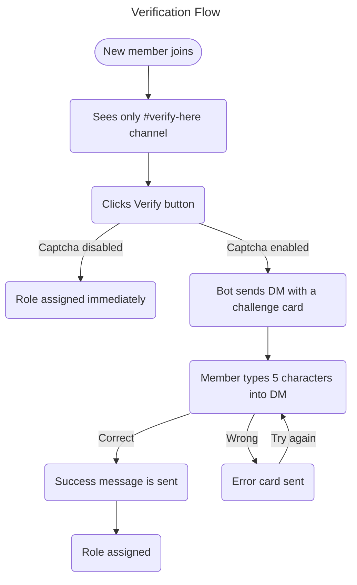

El sistema de verificación de Nightfall añade una **puerta de entrada controlada** a tu servidor. Los nuevos miembros deben completar un paso de verificación antes de obtener acceso a los canales, reduciendo significativamente los raids de bots, el abuso de cuentas alternativas y el troleo casual.

---

## Cómo funciona



---

## Captcha de imagen

Cuando el captcha está activado, cada desafío de verificación es una **imagen renderizada de forma única**:

| Propiedad | Valor |
|----------|-------|
| Tamaño | 340 × 110 px |
| Longitud de la respuesta | 5 caracteres |
| Conjunto de caracteres | `A–Z`, `2–9` — sin caracteres ambiguos (`O`, `0`, `I`, `1`, `l`) |
| Distinción mayúsculas/minúsculas | Ninguna — `a7k2m` y `A7K2M` ambos aceptados |
| Expiración | 10 minutos |

### Propiedades anti‑bypass

| Intento de bypass | Respuesta de Nightfall |
|---------------|---------------------|
| Volver a unirse tras la verificación | El rol no se reasigna automáticamente al reunirse; hay que verificar de nuevo |
| Intentar programar el botón | Las respuestas por DM no pueden ser programadas por librerías de bot estándar |
| Ataques OCR al captcha | Ruido, variación de color por carácter, jitter y desenfoque dificultan el OCR automatizado |
| Reinicio del bot durante la verificación | Las sesiones respaldadas en base de datos aseguran que el desafío siga siendo validado tras el reinicio |

---

## Configuración

### Requisitos

1. Un **rol verificado** que otorgue acceso al resto del servidor
2. Un canal **`#verify-here`** configurado de modo que:
   - `@everyone` — puede ver el canal, no puede enviar mensajes, no puede ver otros canales
   - `@Verified` — acceso completo al servidor
3. Un panel de verificación publicado mediante `/verification post`

### Pasos de configuración recomendados

1. Crea un canal `#verify-here`
2. Establece los permisos del canal:
   - `@everyone` → View Channel ✅ · Send Messages ❌ · el resto de canales ❌
   - `@Verified` → todos los canales ✅
3. Crea un rol `@Verified`
4. Ejecuta `/verification panel` → selecciona el rol → activar → activar Image Captcha
5. Ejecuta `/verification post channel:#verify-here`
6. Mueve el rol del bot Nightfall **por encima** del rol `@Verified` en **Ajustes del servidor → Roles**

---

## Tarjeta DM

**Tarjeta de desafío (enviada cuando se hace clic en Verify):**

```
🔍  Verification Challenge
──────────────────────────────────
To access ServerName you must complete this captcha.

ℹ  Instructions:
› Look at the image below — it contains 5 characters
› Type only those characters in your reply to this DM
› Case‑insensitive — A7K2M and a7k2m both work

⏱️  You have 10 minutes to reply.
──────────────────────────────────
[ captcha image — 340 × 110 px ]
─ Nightfall Security  •  ServerName
```

**Tarjeta completada (DM editado tras respuesta correcta):**

```
✅  Captcha Complete!
──────────────────────────────────
You've been successfully verified in ServerName.
✨  Welcome — you now have full server access.
──────────────────────────────────
[ greyed captcha + large green ✓ overlay ]
─ Nightfall Security  •  ServerName
```

---

## Integración con Anti‑Raid

La verificación actúa como la **primera línea de defensa** contra los raids:

1. Los miembros que se unen llegan al canal de verificación bloqueado
2. Las cuentas bot que no pueden recibir o procesar DMs se detienen aquí
3. Si los raiders eluden la verificación y aún se detecta un pico de entradas, el contador de tasa **Anti‑Raid** se dispara como capa secundaria

---

## Solución de problemas

| Problema | Causa probable | Solución |
|---------|-------------|-----|
| El miembro no recibe DM | DMs desactivados | Pídele que active **Permitir mensajes directos de miembros del servidor** en Ajustes de Privacidad |
| El botón Verify no hace nada | Falta permiso | Asegúrate de que el bot tenga `Manage Roles` |
| No se ven otros canales tras verificar | Permisos de canal incorrectos | Revisa las anulaciones de permisos de canal de `@everyone` |
| Error "Role no longer exists" | Rol verificado eliminado | Establece uno nuevo mediante `/verification panel` |

---

*Relacionado: [Comandos de verificación](/commands/verification) · [Anti‑Raid](/anti-raid)*
