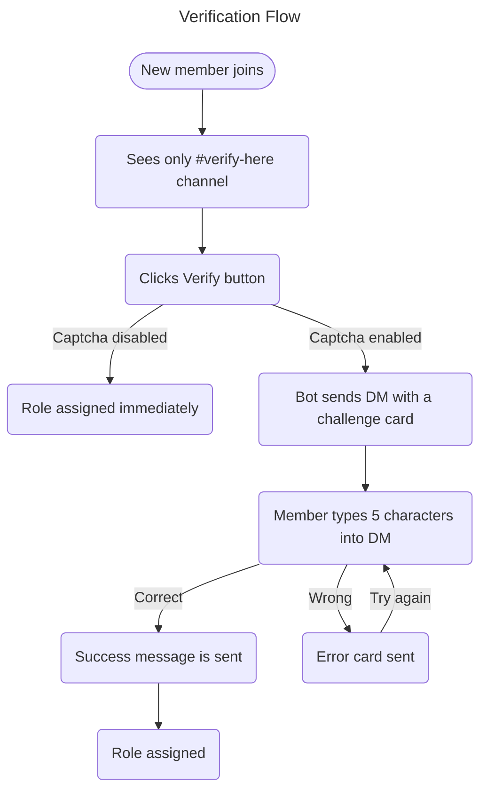

Le système de vérification de Nightfall ajoute une **porte d'entrée contrôlée** à votre serveur. Les nouveaux membres doivent compléter une étape de vérification avant d'obtenir l'accès aux salons, réduisant significativement les raids de bots, les abus de comptes secondaires et le trolling occasionnel.

---

## Fonctionnement



---

## Captcha image

Lorsque le captcha est activé, chaque défi de vérification est une **image rendue de manière unique** :

| Propriété | Valeur |
|-----------|--------|
| Taille | 340 × 110 px |
| Longueur de la réponse | 5 caractères |
| Jeu de caractères | `A–Z`, `2–9` — pas de caractères ambigus (`O`, `0`, `I`, `1`, `l`) |
| Sensibilité à la casse | Aucune — `a7k2m` et `A7K2M` sont tous deux acceptés |
| Expiration | 10 minutes |

### Propriétés anti‑contournement

| Tentative de contournement | Réponse de Nightfall |
|---------------------------|----------------------|
| Rejoindre après vérification | Le rôle n'est pas automatiquement réattribué à la reconnexion ; il faut se vérifier à nouveau |
| Tenter de scripter le bouton | Les réponses par DM ne peuvent pas être scriptées par les bibliothèques de bots standard |
| Attaques OCR sur le captcha | Le bruit, la variation de couleur par caractère, le jitter et le flou entravent l'OCR automatisé |
| Redémarrage du bot pendant la vérification | Les sessions stockées en base de données garantissent que le défi est toujours validé après un redémarrage |

---

## Configuration

### Exigences

1. Un **rôle vérifié** qui accorde l'accès au reste du serveur
2. Un salon **`#verify-here`** configuré de sorte que :
   - `@everyone` — peut voir le salon, ne peut pas envoyer de messages, ne peut pas voir les autres salons
   - `@Verified` — accès complet au serveur
3. Un panneau de vérification publié via `/verification post`

### Étapes de configuration recommandées

1. Créez un salon `#verify-here`
2. Définissez les permissions du salon :
   - `@everyone` → View Channel ✅ · Send Messages ❌ · tous les autres salons ❌
   - `@Verified` → tous les salons ✅
3. Créez un rôle `@Verified`
4. Exécutez `/verification panel` → sélectionnez le rôle → activez → activez Image Captcha
5. Exécutez `/verification post channel:#verify-here`
6. Déplacez le rôle du bot Nightfall **au‑dessus** du rôle `@Verified` dans **Paramètres du Serveur → Rôles**

---

## Carte DM

**Carte de défi (envoyée lorsque Verify est cliqué) :**

```
🔍  Verification Challenge
──────────────────────────────────
To access ServerName you must complete this captcha.

ℹ  Instructions:
› Look at the image below — it contains 5 characters
› Type only those characters in your reply to this DM
› Case‑insensitive — A7K2M and a7k2m both work

⏱️  You have 10 minutes to reply.
──────────────────────────────────
[ captcha image — 340 × 110 px ]
─ Nightfall Security  •  ServerName
```

**Carte de complétion (DM modifié après une réponse correcte) :**

```
✅  Captcha Complete!
──────────────────────────────────
You've been successfully verified in ServerName.
✨  Welcome — you now have full server access.
──────────────────────────────────
[ greyed captcha + large green ✓ overlay ]
─ Nightfall Security  •  ServerName
```

---

## Intégration avec Anti‑Raid

La vérification agit comme la **première ligne de défense** contre les raids :

1. Les membres qui rejoignent arrivent dans le salon de vérification verrouillé
2. Les comptes bots qui ne peuvent pas recevoir ou traiter les DM sont arrêtés ici
3. Si les raiders contournent la vérification et qu'un pic d'arrivées est encore détecté, le compteur de taux **Anti‑Raid** se déclenche comme couche secondaire

---

## Dépannage

| Problème | Cause probable | Solution |
|----------|----------------|----------|
| Le membre ne reçoit aucun DM | DM désactivés | Demandez‑lui d'activer **Autoriser les messages directs des membres du serveur** dans les Paramètres de confidentialité |
| Le bouton Verify ne fait rien | Permission manquante | Assurez‑vous que le bot a `Manage Roles` |
| Impossible de voir les autres salons après vérification | Mauvaises permissions de salon | Passez en revue les substitutions de permission de salon pour `@everyone` |
| Erreur « Role no longer exists » | Rôle vérifié supprimé | Définissez‑en un nouveau via `/verification panel` |

---

*Voir aussi : [Commandes de vérification](/commands/verification) · [Anti‑Raid](/anti-raid)*
