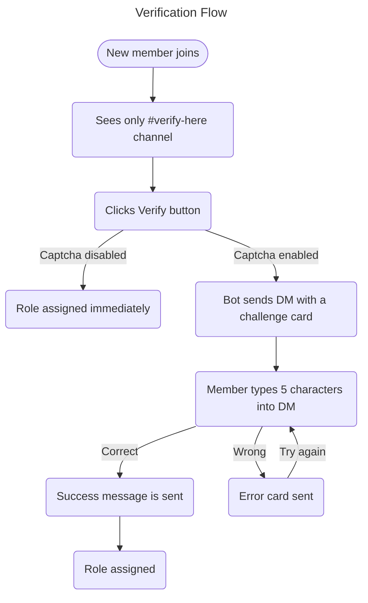

Система верификации Nightfall добавляет **контролируемый вход** на ваш сервер. Новые участники должны пройти шаг верификации перед получением доступа к каналам, значительно снижая бот‑рейды, злоупотребление альт‑аккаунтами и случайный троллинг.

---

## Как это работает



---

## Капча изображения

Когда капча включена, каждая задача верификации представляет собой **уникально отрисованное изображение**:

| Свойство | Значение |
|----------|-------|
| Размер | 340 × 110 px |
| Длина ответа | 5 символов |
| Набор символов | `A–Z`, `2–9` — без неоднозначных символов (`O`, `0`, `I`, `1`, `l`) |
| Чувствительность к регистру | Нет — принимаются как `a7k2m`, так и `A7K2M` |
| Истечение | 10 минут |

### Свойства защиты от обхода

| Попытка обхода | Ответ Nightfall |
|---------------|---------------------|
| Повторное вступление после верификации | Роль не назначается автоматически при повторном вступлении; требуется снова пройти верификацию |
| Попытка скриптовать кнопку | Ответы в DM не могут быть скриптованы стандартными библиотеками ботов |
| Атаки OCR на капчу | Шум, вариация цвета каждого символа, джиттер и размытие затрудняют автоматизированный OCR |
| Перезапуск бота во время верификации | Сессии, поддерживаемые базой данных, гарантируют, что задача всё ещё будет проверена после перезапуска |

---

## Настройка

### Требования

1. **Проверенная роль**, которая предоставляет доступ к остальной части сервера
2. **Канал `#verify-here`**, настроенный так:
   - `@everyone` — может видеть канал, не может отправлять сообщения, не может видеть другие каналы
   - `@Verified` — полный доступ к серверу
3. Панель верификации, опубликованная через `/verification post`

### Рекомендуемые шаги настройки

1. Создайте канал `#verify-here`
2. Установите разрешения канала:
   - `@everyone` → View Channel ✅ · Send Messages ❌ · все остальные каналы ❌
   - `@Verified` → все каналы ✅
3. Создайте роль `@Verified`
4. Запустите `/verification panel` → выберите роль → включите → включите Image Captcha
5. Запустите `/verification post channel:#verify-here`
6. Переместите роль бота Nightfall **выше** роли `@Verified` в **Настройки сервера → Роли**

---

## DM‑карточка

**Карточка задачи (отправляется при нажатии Verify):**

```
🔍  Verification Challenge
──────────────────────────────────
To access ServerName you must complete this captcha.

ℹ  Instructions:
› Look at the image below — it contains 5 characters
› Type only those characters in your reply to this DM
› Case‑insensitive — A7K2M and a7k2m both work

⏱️  You have 10 minutes to reply.
──────────────────────────────────
[ captcha image — 340 × 110 px ]
─ Nightfall Security  •  ServerName
```

**Карточка завершения (DM редактируется после правильного ответа):**

```
✅  Captcha Complete!
──────────────────────────────────
You've been successfully verified in ServerName.
✨  Welcome — you now have full server access.
──────────────────────────────────
[ greyed captcha + large green ✓ overlay ]
─ Nightfall Security  •  ServerName
```

---

## Интеграция с Anti‑Raid

Верификация выступает **первой линией защиты** против рейдов:

1. Вступающие участники попадают в заблокированный канал верификации
2. Аккаунты ботов, которые не могут получать или обрабатывать DM, останавливаются здесь
3. Если рейдеры обходят верификацию, а всплеск вступлений всё ещё обнаружен, счётчик частоты **Anti‑Raid** срабатывает как вторичный уровень

---

## Устранение неполадок

| Проблема | Вероятная причина | Решение |
|---------|-------------|-----|
| Участник не получает DM | DM отключены | Попросите его включить **Разрешить прямые сообщения от участников сервера** в настройках приватности |
| Кнопка Verify ничего не делает | Отсутствует разрешение | Убедитесь, что у бота есть `Manage Roles` |
| Не видно других каналов после верификации | Неверные разрешения канала | Проверьте переопределения разрешений канала для `@everyone` |
| Ошибка «Role no longer exists» | Проверенная роль удалена | Задайте новую через `/verification panel` |

---

*См. также: [Команды верификации](/commands/verification) · [Anti‑Raid](/anti-raid)*
